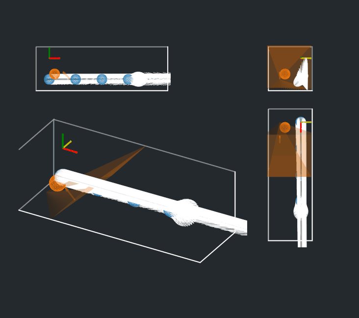
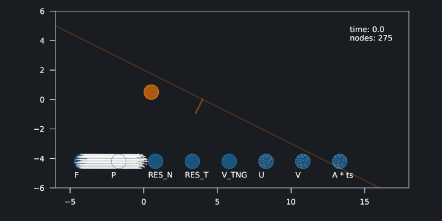
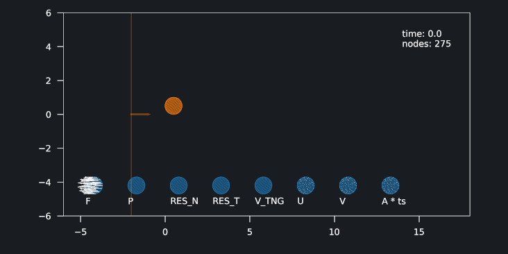

# conmech

conmech is a simulating package written in Python that allows to numerically solve contact mechanics problems. It uses the Finite Element Method, works with static, quasistatic and dynamic models, both in 2D and 3D. It can simulate various physical phenomena, such as Coulomb friction and hardness of the obstacle. Additional variables, such as the temperature of the body, can also be calculated. The code is modular and can be further extended to include other models.

### Sample results

| 2D with temperature | 3D |
:-------------------------:|:-------------------------:
 |  

### Installation

Install Gmsh used for mesh construction and dependencies from "requirements.txt"

    apt-get install python3-gmsh
    pip install -r requirements.txt

### Usage

To run sample simulations, start any file from examples folder

    PYTHONPATH=. python examples/examples_2d.py

# deep_conmech

deep_conmech uses Graph Neural Networks to learn dynamic contact mechanics simulations based on energy function implemented in conmech.

### Sample results

 | 
:-------------------------:|:-------------------------:

### Installation

Follow the instructions to install conmech, and then install additional dependencies by

    pip install -r requirements-deep.txt

### Usage

To generate training and validation sets, start the training process and periodically save learned model parameters, run

    PYTHONPATH=. python deep_conmech/run_model.py --mode=train

To generate sample trajectories using the most current saved model parameters, run

    PYTHONPATH=. python deep_conmech/run_model.py --mode=plot
 

